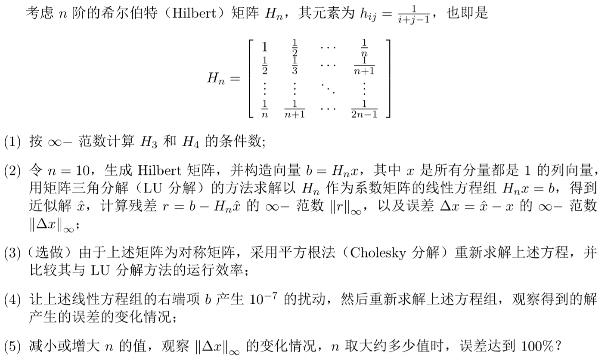

#
数值分析第五次实验报告

计32 顾晓韬 2013011298 

##实验要求
<!---->

##条件数计算
###1. 计算结果
* $cond(H_3) = 748$
* $cond(H_4) = 28375$

###2. 算法描述
给定方阵A，条件数 $cond(A)$ 的计算过程如下

* 矩阵求逆
	
		1. 将原矩阵右边连接一个单位阵;
		2. 通过初等行变换将左边原矩阵部分变为单位阵;
		3. 将右边原单位阵部分取出，作为原矩阵的逆矩阵；

	所得逆矩阵记为 $A^{-1}$.

* 计算矩阵行范数$||A||_\infty$
		
		def line_norm(A):
			ans := -INFINITY;
			for line in A.lines:
				sum := 0;
				for elem in line:
					sum += abs(elem)
				if sum > ans:
					ans := sum;
			return ans;	
		
* 计算条件数

	$cond(A) = ||A||_\infty||A^{-1}||_\infty$
		
##LU分解
###1. 计算结果
当n=10时：

* $||r||_\infty = 2.22045 \cdot 10^{-16}$
* $||\Delta x||_\infty = 0.000436912$

###2. 算法描述
A中的元素记为 $a_{ij} (i,j = 1,2,...,n)$

> $u_{1i} = a_{1i}\ \ \ \ \ \ \  (i=1,2,...,n)$

> $l_{i1} = a_{i1} / u_{11}\ \ (i=1,2,...,n)$

> $u_{ri} = a_{ri} - \sum_{k=1}^{r-1}l_{rk}u_{ki}\ \ \ \ \ \ \ \ \ (i=r,r+1,...n);$

> $l_{ir} = a_{ir} - \sum_{k=1}^{r-1}l_{ik}u_{kr} / u_{rr}\ \ \ \ (i=r+1,...n);$

> $y_1 = b_1$

> $y_i = b_i - \sum_{k=1}^{i-1}l_{ik}y_k\ \ \ \ \ \ \ \ \ \ \ \ \ (i=2,3,...,n)$

> $x_n = y_n / u_{nn}$

> $y_i = (y_i - \sum_{k=i+1}^{n}u_{ik}x_k) / u_{ii}\ \ (i=2,3,...,n)$
	
	

###3. 加入扰动
当对$b$加入$10^{-7}$的扰动后，计算结果如下

* $||r||_\infty = 10^{-7}$
* $||\Delta x||_\infty = 0.700641$

##误差变化
* 不加入扰动，取n=5~19，$||\Delta x||_\infty$变化趋势如图：

	

* 加入$10^{-7}$扰动，取n=5~19，$||\Delta x||_\infty$变化趋势如图：

	

##体会与问题